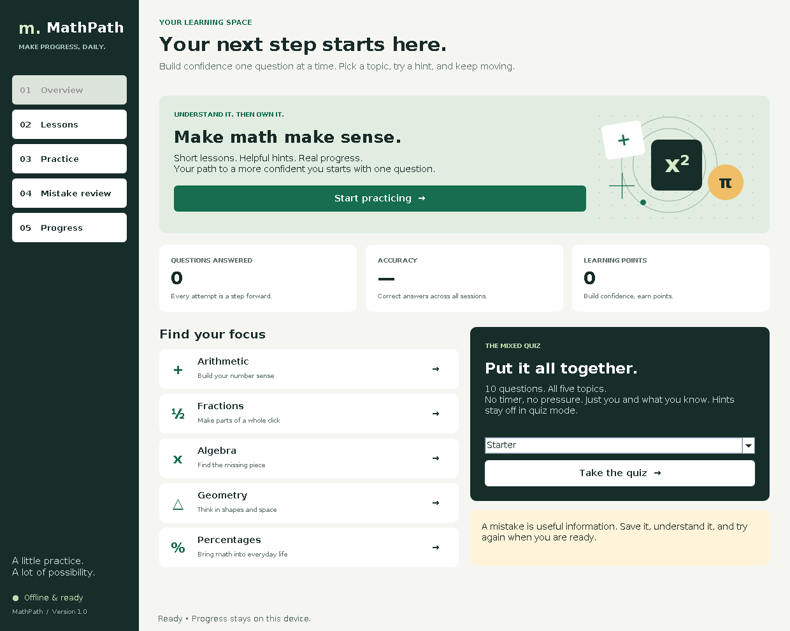

# MathPath

**Learn math. Build confidence.**

An offline Java desktop application that helps students understand arithmetic, fractions, algebra, geometry and percentages through short lessons, guided practice and worked solutions.



## Why I built it

Getting an answer wrong is only useful when you understand why. MathPath gives learners a manageable next step: read a short explanation, try a question, use a hint if needed, and revisit mistakes until they can solve them independently.

I built this project to explore desktop software, exact mathematical modelling, adaptive learning and reliable local persistence. It complements my web and mobile projects with a focused Java application whose behavior can be tested without a browser or external service.

## What you can do

| Feature | How it helps |
| --- | --- |
| Five topic lessons | Read a rule, a worked example and a practical tip before practicing. |
| Generated practice | Work through new questions at Starter, Builder or Challenge level. |
| Adaptive difficulty | Move up after at least five independent correct answers in the latest six at one level. Move down after two or fewer correct answers. |
| Hints and feedback | Get a targeted hint, then see each step of the solution after answering. |
| Mistake review | Revisit wrong or revealed questions. Solve without a hint to clear them. |
| Mixed quiz | Answer ten questions, two per topic, with hints disabled and no timer. |
| Progress dashboard | See lifetime totals, accuracy by topic, points, best independent streak and recent quiz scores. |
| Local saves | Keep progress between launches without signing in or connecting to the internet. |

## Quick start

Requires **Java 17 or newer**. Building from source needs a JDK, including `javac` and `jar`. There are no third-party runtime libraries or dependency downloads.

### Windows

Extract the project ZIP or clone the repository, then open a terminal in the project folder:

```bat
build.bat
run.bat
```

The downloadable project includes a built JAR, so you can also run `run.bat` directly if Java 17+ is installed.

### macOS / Linux

```bash
bash scripts/build.sh
bash scripts/run.sh
```

### Run the packaged application

```bash
java -jar dist/mathpath.jar
```

The application needs a graphical desktop. In VS Code, open the project folder with Java support enabled and run `src/main/java/com/mathpath/MathPath.java`. IntelliJ IDEA and Eclipse can also open the source folder as a Java project.

## How to answer

- Enter a number or a fraction, without units: `12`, `-3`, `0.75`, `3/4` or `6/8`.
- Decimal commas work too: `0,75`.
- Equivalent fractions are accepted. Fractions must match exactly.
- Decimal answers may match the exact answer or the answer rounded to two decimal places using half-up rounding. For example, `1/3` accepts `0.33`.
- Enter just the value of `x` for algebra questions.
- Circle exercises explicitly use **π = 3.14**.
- Press **Enter** to check an answer. Tab moves through interactive controls.

Practice and review allow hints. Correct answers earn 10, 15 or 20 points depending on the level; using a hint earns half, rounded down. A revealed solution or skipped quiz question counts as an incorrect attempt and enters review. Accuracy includes answers solved with hints; streaks count only consecutive correct answers without hints.

Starting a new practice or quiz replaces the active session. Completed answers remain in progress; an unfinished quiz has no quiz-result entry. Navigation between views preserves the active question within the current launch.

## Tests

```bash
bash scripts/test.sh
```

On Windows:

```bat
test.bat
```

The test runner uses no testing dependencies and exits with a non-zero status on failure. It verifies:

- 37 core behaviors, including invalid input, marking, adaptive levels, single submission, review, quiz completion and persistence.
- 15,000 seeded generated exercises, independently recomputing the expected answer across all topics and levels.
- Real Swing control flows, including Enter submission, hints, navigation and a complete quiz.
- Actual Swing screen rendering at the standard and minimum window sizes.

An optional native-window test drives mouse and keyboard input through `java.awt.Robot`:

```bash
bash scripts/test.sh --desktop
# Or on a Linux machine with Xvfb installed:
xvfb-run -a bash scripts/test.sh --desktop
```

On Windows, use `test.bat --desktop`. The optional test opens a window and needs a graphical session; see [the verification report](docs/TESTING.md) for what was verified locally.

The included GitHub Actions workflow runs the automated suite on Linux, Windows and macOS, then runs the native desktop smoke test on Linux and makes the JAR available as a workflow artifact. [The first published verification run](https://github.com/motloungseabelo-gif/MathPath-Java/actions/runs/37061447745) passed on all three platforms, including the Linux native desktop test.

## Design and structure

| Package | Responsibility |
| --- | --- |
| `com.mathpath.core` | Exact rational numbers, question generation, lessons, session state and learning progress. |
| `com.mathpath.storage` | Versioned UTF-8 progress files, validation, atomic replacement and recovery. |
| `com.mathpath.ui` | Swing screens, keyboard-friendly controls and original Java2D artwork. |

```text
src/main/java/com/mathpath/
  MathPath.java
  core/
  storage/
  ui/
src/test/java/com/mathpath/
scripts/
docs/
.github/workflows/
```

The session service can be exercised without the UI. Question parameters are retained so tests can independently verify the generated math. Rational numbers use reduced `BigInteger` fractions, avoiding floating-point equality errors. Saves run in order on a background worker, while Swing updates remain on its event dispatch thread.

Read [the design notes](docs/DESIGN.md) for storage behavior and tradeoffs, or [the portfolio notes](docs/PORTFOLIO.md) for a short project description and demo walkthrough.

## Saved progress

Progress lives in `.mathpath/progress.properties` under your home folder. To use another folder:

```bash
java -Dmathpath.dataDir=/path/to/my-progress -jar dist/mathpath.jar
```

Lifetime totals are retained. Recent attempts are limited to 500, mistake review to the latest 100 distinct questions, and quiz results to the latest 20. When review is full, the oldest entry is removed. A damaged save is preserved as a `progress.corrupt-*.properties` backup before starting fresh. Unsupported versions and unreadable data disable saving to avoid overwriting them.

This is a single learner, single running instance application. The save file is not encrypted. There is no cloud synchronization, formal curriculum alignment, student account system or server backend. The active question is not resumed after closing the app; completed attempts are saved. The automated suite passed on Linux, Windows and macOS; native mouse and keyboard testing also passed on Linux in GitHub Actions.

## Author

**Seabelo Blessing Motloung** — [GitHub](https://github.com/motloungseabelo-gif)

Licensed under the [MIT License](LICENSE).
